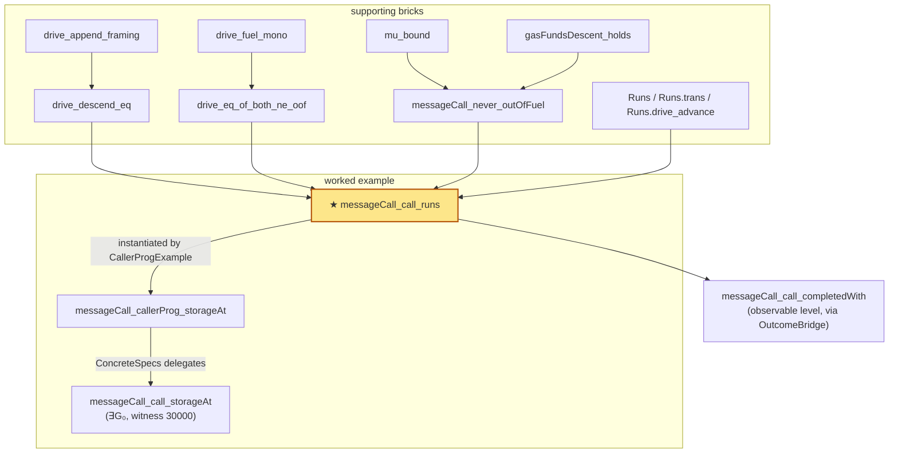

# Experiment 003 — Bytecode Layer: review report

*Branch `exp003-fuel-layer-cleanup`. Scope: the entire `experiments/003_bytecode_layer/` Lean package as it stands after the monolith retirement (commits `4fc9e1e`, `556ebef`) and the file reorg (`c08e04f`…`33e9fc8`). Paths below are relative to `experiments/003_bytecode_layer/`.*

Supersedes the previous version of this file (which described the pre-reorg state with the monolith still present). Two earlier reports are preserved for history: the pre-rebuild snapshot at [`docs/review-report-prerebuild.md`](review-report-prerebuild.md) and the monolith-retirement note at [`docs/review-report-followup.md`](review-report-followup.md).

---

## 1. TL;DR

The experiment formalizes a **bytecode-level layer over leanevm**: a thin Hoare-style program logic for straight-line EVM blocks, a measure proof that `messageCall` never runs out of interpreter fuel, and — the headline of this branch — a **sound, program-agnostic external-CALL sequencing rule** [`messageCall_call_runs`](BytecodeLayer/Hoare/CallSequence.lean#L50). The old proof carried a circular forwarding hypothesis (`behaves_call`/`CallerForwards`) that smuggled the conclusion; that is **entirely gone** (grep-confirmed: zero occurrences). The CALL rule now reconciles a *black-box terminating child* against the caller's actual suffix run using the genuinely unconditional [`messageCall_never_outOfFuel`](BytecodeLayer/Semantics/Interpreter/NeverOutOfFuel.lean#L158) plus fuel monotonicity — no hypothesis is conclusion-shaped (see §5). A worked compositional instantiation [`messageCall_callerProg_storageAt`](BytecodeLayer/Examples/CallerProgExample.lean#L249) drives the real caller/callee bytecode end-to-end, and the `∃G₀` storage spec [`messageCall_call_storageAt`](BytecodeLayer/Examples/ConcreteSpecs.lean#L95) now has exactly **one** (compositional) proof.

**Verification status (one line):** zero `sorry`/`admit`/`native_decide`/`bv_decide`/`maxHeartbeats` in `BytecodeLayer/` (the only matches are the word "sorry" inside a Maps docstring); `lake build` reported warning-free at 1127 jobs (reported, not re-run here); `#print axioms` over the five headline results is **`[propext, Classical.choice, Quot.sound]`** — **re-run by this reviewer**, see §6.

---

## 2. Goal & context

Real-world property: *a contract that issues an external `CALL` to another contract leaves the expected persistent storage effect, with gas treated as a first-class, observable quantity* — and, dually, *the top-level `messageCall` interpreter never spuriously reports `OutOfFuel`* (out-of-gas is a real halt; fuel is just a Lean termination device and must not leak into the semantics).

The package is layered as a topic tree mirroring leanevm's `Evm/Semantics/` (see the root [`BytecodeLayer.lean`](BytecodeLayer.lean#L1)). Two milestones:

- **M1 — the call-free spine:** straight-line `PUSH`/`SSTORE`/`STOP` programs, verified by composing per-opcode `Runs` rules.
- **M2 — the external-CALL rung:** a caller bytecode that `CALL`s a callee, with the 63/64 gas cap genuinely observable (hence a *forced* gas floor `∃G₀`).

Observables are deliberately minimal — success/output and a single storage cell, read exactly as the EVM's `SLOAD` ([`CallResult.storageAt`](BytecodeLayer/Observables.lean#L49)).

---

## 3. The abstraction stack (bottom-up) and module map

The headline CALL rule sits on top of four layers. Every file in scope is accounted for in the table; the dependency edges that feed the headline follow.

| Layer | File | Role |
|---|---|---|
| **0. Data/world** | [`Programs.lean`](BytecodeLayer/Programs.lean#L1) | The example bytecode (`stopProgram`…`callerProg`/`calleeProg`), addresses, and `CallParams` entry points. No theorems. |
| | [`Observables.lean`](BytecodeLayer/Observables.lean#L1) | `Observables`, `CallResult.storageAt`, and the named [`Outcome`](BytecodeLayer/Observables.lean#L72) decoder (`completed`/`reverted`/`exception`). |
| **1. Semantic leaf facts** | [`Semantics/UInt64.lean`](BytecodeLayer/Semantics/UInt64.lean#L1) | One `UInt64` gas-subtraction fact (`toNat_sub_ofNat`). |
| | [`Semantics/Maps.lean`](BytecodeLayer/Semantics/Maps.lean#L1) | The two missing `TransCmp` instances + `find?`/`findD` framing the SSTORE rule needs. |
| | [`Semantics/Gas.lean`](BytecodeLayer/Semantics/Gas.lean#L1) | Per-step gas decrease for every non-`System` opcode (`stepFrame_next_lt`). |
| | [`Semantics/Precompiles.lean`](BytecodeLayer/Semantics/Precompiles.lean#L1) | Precompiles consume `≤` forwarded gas (`beginCall_inr_gas`, feeds conjunct 5a). |
| | [`Semantics/Dispatch.lean`](BytecodeLayer/Semantics/Dispatch.lean#L1) | `stepFrame` per-opcode characterizations (`stepFrame_push1`, `stepFrame_sstore`, `stepFrame_stop`, `stepFrame_sstore_oog`, …). |
| | [`Semantics/System.lean`](BytecodeLayer/Semantics/System.lean#L1) | The `System`-op (CALL/CREATE/halt/resume) facts: `stepFrame_call`, `beginCall_*`, `resumeAfterCall`/`resumeAfterCreate` gas lemmas. The largest file (1517 lines). |
| **2. Interpreter / fuel** | [`Semantics/Interpreter/Drive.lean`](BytecodeLayer/Semantics/Interpreter/Drive.lean#L1) | The `drive` vocabulary: `drive_step`, `drive_halt`, `driveG_*`, `drive_fuel_mono`, `seedFuel`, `messageCall_eq_drive`. |
| | [`Semantics/Interpreter/Measure.lean`](BytecodeLayer/Semantics/Interpreter/Measure.lean#L1) | The measure `μ` and the general bound `mu_bound` (modulo `gasFundsDescent`). |
| | [`Semantics/Interpreter/NeverOutOfFuel.lean`](BytecodeLayer/Semantics/Interpreter/NeverOutOfFuel.lean#L1) | Discharges `gasFundsDescent`; yields the **unconditional** `messageCall_never_outOfFuel`. |
| | [`Semantics/Interpreter/DescentEq.lean`](BytecodeLayer/Semantics/Interpreter/DescentEq.lean#L1) | The generic CALL-boundary framing/descent equation (`drive_append_framing`, `drive_descend_eq`). |
| **3. Hoare program logic** | [`Hoare.lean`](BytecodeLayer/Hoare.lean#L1) | `StepsTo`/`Runs`/`Runs.trans`, the opcode rules, `messageCall_runs`, SSTORE effect+framing. |
| | [`Hoare/Sequence.lean`](BytecodeLayer/Hoare/Sequence.lean#L1) | `subCharges`/`toNat_subCharges` gas-threading + sequence decode lemmas. |
| | [`Hoare/Behaves.lean`](BytecodeLayer/Hoare/Behaves.lean#L1) | The `Behaves pre code post` for-all-programs predicate (defined; not yet consumed by an export). |
| | [`Hoare/OutcomeBridge.lean`](BytecodeLayer/Hoare/OutcomeBridge.lean#L1) | `ofCall_completed_of_success` — `.ok r`+success ⟶ named `Outcome.completed`. (File renamed from `Straightline.lean`.) |
| | [`Hoare/CallSequence.lean`](BytecodeLayer/Hoare/CallSequence.lean#L1) | **The keystone:** `messageCall_call_runs` + `messageCall_call_completedWith`. |
| **4. The CALL bricks** | [`ExternalCall.lean`](BytecodeLayer/ExternalCall.lean#L1) | Reusable per-program bricks: `childGas`, the frames/decode lemmas, `final_obs`, and the **forced counterexample** `call_counterexample`. (Monolith deleted; ~204 lines dropped.) |
| **5. Audit surface** | [`Spec.lean`](BytecodeLayer/Spec.lean#L1) | The exported general rules a user instantiates. **The file to read.** |
| **Examples** | [`Examples/ProgramDecode.lean`](BytecodeLayer/Examples/ProgramDecode.lean#L1) | Per-pc decode facts for M1 programs. |
| | [`Examples/ProgramExamples.lean`](BytecodeLayer/Examples/ProgramExamples.lean#L1) | The M1 capstones (`*'` lemmas) composed from opcode rules. |
| | [`Examples/CallerProgExample.lean`](BytecodeLayer/Examples/CallerProgExample.lean#L1) | The compositional instantiation of the CALL rule on real bytecode. |
| | [`Examples/ConcreteSpecs.lean`](BytecodeLayer/Examples/ConcreteSpecs.lean#L1) | The per-program `messageCall` observations (delegating wrappers). |
| | [`Examples/HoareDemo.lean`](BytecodeLayer/Examples/HoareDemo.lean#L1) | A standalone demo of the Hoare workflow on `sstoreProgram`. |

**Dependency edges feeding the headline** [`messageCall_call_runs`](BytecodeLayer/Hoare/CallSequence.lean#L50):



---

## 4. The specs that matter

### 4.1 Fuel sufficiency — the unconditional `never-out-of-fuel`

The measure ([`Measure.lean`](BytecodeLayer/Semantics/Interpreter/Measure.lean#L77)) sums gas across the running component and every suspended parent, with a kind-aware withholding for open CREATE descents:

```lean
def totalGas (stack : List Pending) (state : Frame ⊕ FrameResult) : ℕ :=
  activeGas state + (stack.map Pending.savedGas).sum

def μ (stack : List Pending) (state : Frame ⊕ FrameResult) : ℕ :=
  2 * totalGas stack state + 2 * stack.length + tagBit state
```

The general bound [`mu_bound`](BytecodeLayer/Semantics/Interpreter/Measure.lean#L129) is induction on fuel: every `drive` recursion strictly drops `μ`; the CALL/CREATE descent and `System`-`.next` fallback drops are taken as the [`gasFundsDescent`](BytecodeLayer/Semantics/Interpreter/Measure.lean#L103) hypothesis there, then discharged in [`NeverOutOfFuel.lean`](BytecodeLayer/Semantics/Interpreter/NeverOutOfFuel.lean#L151) (`gasFundsDescent_holds`, five gas-arithmetic conjuncts). The boundary theorem is **unconditional** — no fuel/`Frame` in the statement:

```lean
theorem messageCall_never_outOfFuel (p : CallParams) :
    messageCall p ≠ .error .OutOfFuel
```
[`NeverOutOfFuel.lean#L158`](BytecodeLayer/Semantics/Interpreter/NeverOutOfFuel.lean#L158). *Proof strategy:* `mu_bound gasFundsDescent_holds` started at `μ [] (running frame) = 2·p.gas + 2 ≤ seedFuel p.gas`.

### 4.2 The generic CALL-boundary descent equation

[`drive_descend_eq`](BytecodeLayer/Semantics/Interpreter/DescentEq.lean#L153) is the program-agnostic replacement for the old fuel-explicit `child_run`. It says a parent's in-line descent into a *terminating* child equals running that child independently and then resuming the parent:

```lean
theorem drive_descend_eq (f : ℕ) (child : Frame) (res : FrameResult)
    (pd : PendingCall) (ps : List Pending)
    (h : drive f [] (running child) = .ok res) :
    ∃ j, drive f (.call pd :: ps) (running child)
      = drive j ps (running (resumeAfterCall res.toCallResult pd))
```

It is obtained from the central framing lemma [`drive_append_framing`](BytecodeLayer/Semantics/Interpreter/DescentEq.lean#L57) (an inert bottom stack segment is untouched while execution proceeds above it), then peeling one `.call` resume step. *Proof strategy:* induction on fuel following `drive`'s own recursion; the residual fuel `j` is existential, so no exact bookkeeping.

### 4.3 The Hoare core — `Runs`, sequencing, opcode rules

The composition relation never names a trace ([`Hoare.lean#L86`](BytecodeLayer/Hoare.lean#L86)):

```lean
inductive Runs : ℕ → Frame → Frame → Prop where
  | refl (fr : Frame) : Runs 0 fr fr
  | head {n : ℕ} {fr mid fr' : Frame} (h : StepsTo fr mid) (rest : Runs n mid fr') :
      Runs (n + 1) fr fr'
```

with the **sequencing rule** [`Runs.trans`](BytecodeLayer/Hoare.lean#L97), per-opcode rules (`runs_push1`, `runs_push`, `runs_sstore`), and the intra-frame boundary bridge [`messageCall_runs`](BytecodeLayer/Hoare.lean#L136). The SSTORE rule carries an effect+framing pair ([`sstoreFrame_storage_self`](BytecodeLayer/Hoare.lean#L238) / [`sstoreFrame_storage_frame`](BytecodeLayer/Hoare.lean#L258)). All of these are re-exported on `Spec.lean`.

### 4.4 The headline — the sound external-CALL sequencing rule

```lean
theorem messageCall_call_runs {n₁ n₂ : ℕ} {cp : CallParams}
    {fr₀ callFr child last : Frame}
    {childRes : FrameResult} {pending : PendingCall} {halt : FrameHalt}
    (p : CallParams)
    (hbegin   : EntersAsCode p fr₀)
    (hpre     : Runs n₁ fr₀ callFr)
    (hcall    : stepFrame callFr = .needsCall cp pending)
    (hcbegin  : EntersAsCode cp child)
    (hchild   : drive (seedFuel cp.gas) [] (running child) = .ok childRes)
    (hpost    : Runs n₂ (resumeAfterCall childRes.toCallResult pending) last)
    (hhalt    : stepFrame last = .halted halt)
    (hfuel    : seedFuel cp.gas + n₁ + 1 ≤ seedFuel p.gas) :
    messageCall p = .ok (FrameResult.toCallResult (endFrame last halt))
```
[`CallSequence.lean#L50`](BytecodeLayer/Hoare/CallSequence.lean#L50), re-exported at [`Spec.lean#L152`](BytecodeLayer/Spec.lean#L152).

**What it claims:** a caller that enters as code, `Runs` its prefix to a CALL site, issues a CALL whose child *terminates as a black box*, then `Runs` its suffix to a halt site, produces exactly the caller's halt result as the top-level `messageCall`. *Proof strategy:* reduce `messageCall` to a `drive` equation; chain prefix (`Runs.drive_advance`) → CALL step (`driveG_needsCall_code`) → `drive_descend_eq` to the resumed parent at some fuel `j`; reconcile that `j`-fuel run against the concrete suffix run via [`drive_eq_of_both_ne_oof`](BytecodeLayer/Hoare/CallSequence.lean#L30) (both avoid `OutOfFuel` — the prefix side because of `messageCall_never_outOfFuel`, the suffix side because it terminates).

The observable-level lift [`messageCall_call_completedWith`](BytecodeLayer/Hoare/CallSequence.lean#L139) (re-exported [`Spec.lean#L174`](BytecodeLayer/Spec.lean#L174)) adds success+cell hypotheses to land the named `Outcome.completedWith`.

### 4.5 The worked instantiation and the `∃G₀` spec

[`messageCall_callerProg_storageAt`](BytecodeLayer/Examples/CallerProgExample.lean#L249) drives the real `callerProg`/`calleeProg` by instantiating §4.4 — prefix = seven pushes glued by `Runs.trans` (five `runs_push1`, two `runs_push`), `hchild` = the genuine reflexive callee run, suffix = the `STOP`, fuel discharged by `omega` off `childGas_le_caller`. The exported `∃G₀` spec now delegates to it (single proof):

```lean
theorem messageCall_call_storageAt :
    ∃ G₀ : ℕ, ∀ g : UInt64, G₀ ≤ g.toNat →
      (messageCall (callerParams g)).map (fun r => CallResult.storageAt r addrCallee 7) = .ok 5 :=
  ⟨30000, fun g hg => messageCall_callerProg_storageAt g hg⟩
```
[`ConcreteSpecs.lean#L95`](BytecodeLayer/Examples/ConcreteSpecs.lean#L95).

The floor is *forced*, witnessed by the executable counterexample [`call_counterexample`](BytecodeLayer/Examples/ConcreteSpecs.lean#L106) (at `g = 24000` the 63/64 cap starves the callee, its `SSTORE` OOGs, the cell reads `0`, yet the top-level call still completes). The M1 call-free capstones ([`messageCall_sstore_storageAt`](BytecodeLayer/Examples/ConcreteSpecs.lean#L60), [`messageCall_seq_storageAt`](BytecodeLayer/Examples/ConcreteSpecs.lean#L70), …) are observables-only and stated with a plain gas `≤` hypothesis (the program's exact cost).

---

## 5. Hypotheses & modeling — soundness verdict

**World model:** `World := CallParams` ([`Behaves.lean#L36`](BytecodeLayer/Hoare/Behaves.lean#L36)); a call's entire world (account map ⟹ all storage, gas, caller, calldata, depth) is its entry params. Results are observed only through `Observables`/`storageAt`/`Outcome`.

**Is any hypothesis conclusion-shaped? No.** This is the crux of the rebuild. The retired proof assumed a `CallerForwards`/`behaves_call` hypothesis of the form "the caller forwards the child's observable" — i.e. it *assumed the very forwarding it was meant to prove* (circular). That symbol is gone (grep-confirmed zero occurrences of `behaves_call`/`CallerForwards`/`messageCall_child_reflexive`). In the current [`messageCall_call_runs`](BytecodeLayer/Hoare/CallSequence.lean#L50) every hypothesis is a *structural* fact about how the bytecode executes:

- `hpre`/`hpost` are honest `Runs` traces of the caller's prefix and suffix — not an assumed outcome;
- `hchild` consumes the child as a **black box** (`drive … = .ok childRes`): *any* terminating child, with no oracle on what it computes;
- `hcall`/`hcbegin`/`hhalt` are `stepFrame`/`beginCall` inversions;
- `hfuel : seedFuel cp.gas + n₁ + 1 ≤ seedFuel p.gas` is the **single numeric** side condition — pure gas arithmetic, not the conclusion.

The reconciliation that the old hypothesis used to paper over is now *proved*: `drive_descend_eq` (sound descent) + `messageCall_never_outOfFuel` (the prefix can't be OOF) + fuel monotonicity. So the rule is genuinely load-bearing and sound.

---

## 6. Results taxonomy

**Verification status (stated once):** no `sorry`/`admit`/`native_decide`/`bv_decide`/`maxHeartbeats` anywhere in `BytecodeLayer/`. `lake build` reported warning-free, 1127 jobs (commit `556ebef`; reported, not re-run). **Axioms re-run by this reviewer** via `lake env lean` `#print axioms` — all five are exactly `[propext, Classical.choice, Quot.sound]`:

| Theorem | Axioms |
|---|---|
| [`Hoare.messageCall_call_runs`](BytecodeLayer/Hoare/CallSequence.lean#L50) | propext, Classical.choice, Quot.sound |
| [`Examples.messageCall_callerProg_storageAt`](BytecodeLayer/Examples/CallerProgExample.lean#L249) | propext, Classical.choice, Quot.sound |
| [`Examples.messageCall_call_storageAt`](BytecodeLayer/Examples/ConcreteSpecs.lean#L95) | propext, Classical.choice, Quot.sound |
| [`Examples.call_counterexample`](BytecodeLayer/Examples/ConcreteSpecs.lean#L106) | propext, Classical.choice, Quot.sound |
| [`Interpreter.messageCall_never_outOfFuel`](BytecodeLayer/Semantics/Interpreter/NeverOutOfFuel.lean#L158) | propext, Classical.choice, Quot.sound |

**Headline / mainline:** [`messageCall_call_runs`](BytecodeLayer/Hoare/CallSequence.lean#L50), [`messageCall_call_completedWith`](BytecodeLayer/Hoare/CallSequence.lean#L139), [`messageCall_never_outOfFuel`](BytecodeLayer/Semantics/Interpreter/NeverOutOfFuel.lean#L158).

**Supporting bricks (load-bearing):** [`drive_append_framing`](BytecodeLayer/Semantics/Interpreter/DescentEq.lean#L57), [`drive_descend_eq`](BytecodeLayer/Semantics/Interpreter/DescentEq.lean#L153), [`drive_eq_of_both_ne_oof`](BytecodeLayer/Hoare/CallSequence.lean#L30), [`mu_bound`](BytecodeLayer/Semantics/Interpreter/Measure.lean#L129), [`gasFundsDescent_holds`](BytecodeLayer/Semantics/Interpreter/NeverOutOfFuel.lean#L151), the `Runs` core + opcode rules ([`Hoare.lean`](BytecodeLayer/Hoare.lean#L97)), and the `System`/`Gas`/`Dispatch`/`Maps`/`Precompiles` leaf facts.

**Examples / demos:** [`messageCall_callerProg_storageAt`](BytecodeLayer/Examples/CallerProgExample.lean#L249) is consumed by the exported `∃G₀` spec — *not* a dead leaf. The M1 `*'` lemmas in [`ProgramExamples.lean`](BytecodeLayer/Examples/ProgramExamples.lean#L1) are consumed by `ConcreteSpecs`. [`hoare_demo`](BytecodeLayer/Examples/HoareDemo.lean#L154) is a true leaf (illustration only, nothing depends on it). `call_counterexample` is consumed by `ConcreteSpecs` and justifies the `∃G₀` shape.

**Smells, with the headline-dependency call:**

- **`decide` on concrete terms** in [`ExternalCall.lean`](BytecodeLayer/ExternalCall.lean#L1) (e.g. `sstoreChargeOf_child`, `childGas_lb`, `callerXfer_storage`) and the M1 examples — and **`set_option maxRecDepth 4000`** in [`CallerProgExample.lean#L41`](BytecodeLayer/Examples/CallerProgExample.lean#L41), [`ProgramExamples.lean#L36`](BytecodeLayer/Examples/ProgramExamples.lean#L36), [`HoareDemo.lean#L29`](BytecodeLayer/Examples/HoareDemo.lean#L29). These evaluate concrete gas constants on fixed witness programs. **Dependency call:** they sit under the *worked example* `messageCall_callerProg_storageAt` and the M1 capstones — which the exported concrete specs depend on. So they *are* under a (concrete) headline, but the **general** rules (`messageCall_call_runs`, `messageCall_never_outOfFuel`) use **no** `decide`/`maxRecDepth` and are fully program-agnostic. The risk is contained to the concreteness of the witnesses, not to the general theory.
- **Single caller/callee witness.** The entire M2 observable story rides one hardcoded program pair (`callerProg`/`calleeProg`) and one CALL site. The general rule is parametric, but the *exercised* evidence is one example — see §7.
- **No `set_option maxHeartbeats`** anywhere (good — no reduction blow-up was papered over).

---

## 7. Honest rough edges & open questions

1. **Altitude caveat (flagged in-source).** The program-logic rules re-exported on [`Spec.lean`](BytecodeLayer/Spec.lean#L22) are **frame-level** (`Runs`/`Frame`/`stepFrame`), in tension with the experiment's "observables-only exported surface" standard. Only `messageCall_call_completedWith` is fully observable. Per memory note *exp003-frame-level-surface-ok*, this is accepted for this low-level layer, but the `Spec.lean` docstring itself says "To reconcile."

2. **`Behaves` is defined but unconsumed.** [`Behaves.lean`](BytecodeLayer/Hoare/Behaves.lean#L45) sets up the for-all-programs predicate the generalization plan wants, but no exported theorem is yet phrased through it. It is scaffolding ahead of use.

3. **Single-witness M2.** No nested calls, no non-zero `value` (every example is value-0), no `RETURN`-carrying callee, one CALL site. The general `messageCall_call_runs` does *not* assume these away (it is parametric and the child is a black box), but the only *instantiation* is the one program pair.

4. **Stale doc evidence (Phase-4 territory, not soundness).** The [`docs/results.md`](results.md) and [`docs/handoff.md`](handoff.md) files carry `#print axioms`/job-count prose that predates the rebuild and should be regenerated before they are trusted — treat the live `#print axioms` in §6 as authoritative, not those docs. (The in-source docstrings that previously pointed at reorg-deleted files have since been swept and rewritten, so no dangling code references remain.)

**Natural next steps:** (a) phrase one external-call export through `Behaves`/`Outcome` to retire the altitude caveat; (b) add a second, structurally different callee (e.g. one that `RETURN`s) to widen the M2 witness; (c) regenerate the `results.md`/`handoff.md` axiom/job-count evidence.
