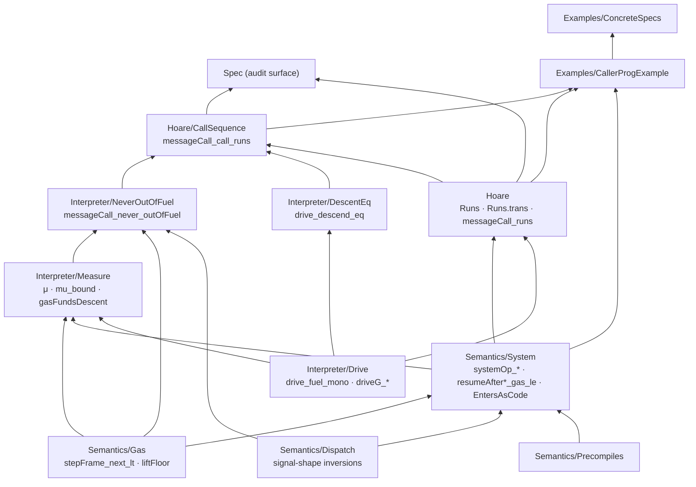

# Review report — experiment 003 (bytecode layer): the sound external-CALL sequencing rule

*Specs-first navigation surface. Read this instead of opening the tree; every code
reference links to the exact current line. Companion reports:
[`review-report-prerebuild.md`](review-report-prerebuild.md) (the state before the
external-call rebuild) and [`review-report-followup.md`](review-report-followup.md)
(the rebuild follow-up notes). The status files [`results.md`](results.md) and
[`handoff.md`](handoff.md) should point here as the navigation surface.*

---

## 1. TL;DR

Experiment 003 builds a **frame-level program-logic layer** over the leanevm
`messageCall`/`drive` interpreter and proves the **sound, program-agnostic
external-CALL sequencing rule**
[`messageCall_call_runs`](../BytecodeLayer/Hoare/CallSequence.lean#L122): a caller
that runs to a CALL site, fires a CALL whose child terminates as a *black box*,
then runs from the resumed frame to a halt, yields the expected `messageCall`
result — with **no numeric fuel side condition** and **no conclusion-shaped
hypothesis**. The fuel bound is discharged internally, resting on the
unconditional
[`messageCall_never_outOfFuel`](../BytecodeLayer/Semantics/Interpreter/NeverOutOfFuel.lean#L158)
(a gas-measure argument) and the generic CALL-boundary decomposition
[`drive_descend_eq`](../BytecodeLayer/Semantics/Interpreter/DescentEq.lean#L153).
The earlier circular `behaves_call`/`CallerForwards`/`hforward` forwarding
hypothesis and the monolith `messageCall_call_eq`/`child_run` are **deleted**
(grep-confirmed: zero occurrences). The rule is exercised compositionally on a
real caller/callee pair, and a forced `∃G₀` plus an executable counterexample
pin the 63/64 gas floor.

Verification (re-run): `lake build` green at **1127 jobs**, zero warnings; **zero
`sorry`/`admit`/`native_decide`/`bv_decide`** anywhere in `BytecodeLayer/`;
`#print axioms` over the audit surface and all headlines is uniformly
`[propext, Classical.choice, Quot.sound]` (table in §6).

---

## 2. Goal & context

The real-world property: **a CALL between two contracts composes** — once you know
how the caller bytecode runs up to and after a CALL, and that the callee terminates,
you know the top-level `messageCall` result, *including* the persistent storage the
callee committed, and *including* the gas reality that a starved callee silently
rolls back while the caller completes cleanly. The hard part is doing this without
(a) an oracle that assumes what the callee returns, or (b) a fuel/termination
side-condition smuggled in by the caller.

The model: programs are raw EVM bytecode (`ByteArray`), run through leanevm's
`messageCall`. The interpreter `drive` is fuel-indexed; a top-level call seeds
`seedFuel p.gas` fuel. The whole experiment is, structurally, a proof that this
fuel is always enough (so it never leaks into specs) plus a thin Hoare-style layer
to compose opcode steps and CALL boundaries.

Observables are deliberately narrow ([`Observables.lean`](../BytecodeLayer/Observables.lean)):
the world-independent [`Observables`](../BytecodeLayer/Observables.lean#L24)
(`success`, `output`), the single-cell reader
[`CallResult.storageAt`](../BytecodeLayer/Observables.lean#L49), and the named
[`Outcome`](../BytecodeLayer/Observables.lean#L72)
(`completed`/`reverted`/`exception`) with
[`Outcome.completedWith`](../BytecodeLayer/Observables.lean#L100).

---

## 3. The abstraction stack (bottom-up) and what feeds the headline

The tree mirrors leanevm's `Evm/Semantics/` so the reusable facts can upstream
(plan: [`file-structure-plan.md`](file-structure-plan.md), executed). Two trunks:
the **never-out-of-fuel measure argument** (Semantics/Interpreter) and the
**Hoare composition layer** (Hoare/), meeting at `messageCall_call_runs`.

### Module map (every file in scope)

| File | Layer | Role |
|---|---|---|
| [`Semantics/UInt64.lean`](../BytecodeLayer/Semantics/UInt64.lean) | leaf | the one `toNat_sub_ofNat` gas-threading arith fact |
| [`Semantics/Maps.lean`](../BytecodeLayer/Semantics/Maps.lean) | leaf | `find?`/`findD` framing equations for the SSTORE storage reads |
| [`Semantics/Gas.lean`](../BytecodeLayer/Semantics/Gas.lean) | leaf | per-step gas decrease (`stepFrame_next_lt`); the 63/64 floor (`liftFloor`); CALL/CREATE own-cost lower bounds |
| [`Semantics/Precompiles.lean`](../BytecodeLayer/Semantics/Precompiles.lean) | leaf | precompile gas bounds (the `*_gas_le`, `beginCall_inr_gas`) |
| [`Semantics/Dispatch.lean`](../BytecodeLayer/Semantics/Dispatch.lean) | leaf | `stepFrame`/`dispatch` signal-shape inversions (`onlyNext`, systemOp bridges) |
| [`Semantics/System.lean`](../BytecodeLayer/Semantics/System.lean) | mid | CALL/CREATE/halt/resume machinery: `stepFrame_call`, `EntersAsCode`, `beginCall_*`, `resumeAfter*` gas bounds, `systemOp_*` descent/fallback inversions |
| [`Semantics/Interpreter/Drive.lean`](../BytecodeLayer/Semantics/Interpreter/Drive.lean) | mid | `drive` vocabulary + fuel monotonicity (`drive_step/halt`, `driveG_*`, `drive_fuel_mono`, `messageCall_eq_drive`) |
| [`Semantics/Interpreter/Measure.lean`](../BytecodeLayer/Semantics/Interpreter/Measure.lean) | mid | the measure `μ`, `mu_bound` (modulo `gasFundsDescent`), boundary theorem |
| [`Semantics/Interpreter/NeverOutOfFuel.lean`](../BytecodeLayer/Semantics/Interpreter/NeverOutOfFuel.lean) | **headline** | discharges `gasFundsDescent_holds`; unconditional `messageCall_never_outOfFuel` |
| [`Semantics/Interpreter/DescentEq.lean`](../BytecodeLayer/Semantics/Interpreter/DescentEq.lean) | mid | generic CALL-boundary decomposition `drive_append_framing` → `drive_descend_eq` |
| [`Hoare.lean`](../BytecodeLayer/Hoare.lean) | mid | `StepsTo`/`Runs`/`Runs.trans`; `Runs.drive_advance`; opcode rules; SSTORE effect/frame |
| [`Hoare/Behaves.lean`](../BytecodeLayer/Hoare/Behaves.lean) | leaf | the for-all-programs `Behaves` predicate — **defined but unconsumed** (see §7) |
| [`Hoare/Sequence.lean`](../BytecodeLayer/Hoare/Sequence.lean) | leaf | `subCharges`/`toNat_subCharges` gas-threading; `seqProgram` decode facts |
| [`Hoare/OutcomeBridge.lean`](../BytecodeLayer/Hoare/OutcomeBridge.lean) | leaf | `ofCall_completed_of_success` (raw `.ok` → named `Outcome.completed`) |
| [`Hoare/CallSequence.lean`](../BytecodeLayer/Hoare/CallSequence.lean) | **headline** | `drive_eq_of_both_ne_oof`, `messageCall_runs`, `CallReturns`, `messageCall_call_runs`, `messageCall_call_completedWith` |
| [`ExternalCall.lean`](../BytecodeLayer/ExternalCall.lean) | example support | caller/callee fixtures, `childGas`/`childGas_lb`, decode facts, `final_obs`, `call_counterexample` proof |
| [`Programs.lean`](../BytecodeLayer/Programs.lean) | data | the handwritten bytecode contracts and `CallParams` entry points |
| [`Examples/ProgramDecode.lean`](../BytecodeLayer/Examples/ProgramDecode.lean) | example | per-pc `decode` facts for the call-free programs |
| [`Examples/ProgramExamples.lean`](../BytecodeLayer/Examples/ProgramExamples.lean) | example | the call-free `*'` observe/storage lemmas (composed from opcode rules) |
| [`Examples/HoareDemo.lean`](../BytecodeLayer/Examples/HoareDemo.lean) | example | standalone compositional demo on `sstoreProgram` (`hoare_demo`) |
| [`Examples/CallerProgExample.lean`](../BytecodeLayer/Examples/CallerProgExample.lean) | example | compositional instantiation of `messageCall_call_runs` on caller/callee |
| [`Examples/ConcreteSpecs.lean`](../BytecodeLayer/Examples/ConcreteSpecs.lean) | example | per-program observable specs; the `∃G₀` `messageCall_call_storageAt` |
| [`Spec.lean`](../BytecodeLayer/Spec.lean) | **audit surface** | re-exports the general program-logic + external-CALL rules |

### Dependency graph feeding the headline



The headline `messageCall_call_runs` composes exactly three load-bearing pieces:
`messageCall_never_outOfFuel` (the fuel bound vanishes), `drive_descend_eq` (the
CALL boundary decomposes), and the `Runs`/`drive` plumbing of `Hoare.lean` +
`Drive.lean`.

---

## 4. The specs that matter

### 4.1 Headline — the sound external-CALL rule

[`messageCall_call_runs`](../BytecodeLayer/Hoare/CallSequence.lean#L122):

```lean
theorem messageCall_call_runs (p : CallParams) {n₁ n₂ : ℕ}
    {fr₀ callFr resumeFr last : Frame} {halt : FrameHalt}
    (hbegin   : EntersAsCode p fr₀)
    (hpre     : Runs n₁ fr₀ callFr)
    (hcallret : CallReturns callFr resumeFr)
    (hpost    : Runs n₂ resumeFr last)
    (hhalt    : stepFrame last = .halted halt) :
    messageCall p = .ok (FrameResult.toCallResult (endFrame last halt))
```

Read it as a five-link chain: `fr₀ ─Runs→ callFr ─CallReturns→ resumeFr ─Runs→
last ─halt`. The determined frames (`callFr`, `resumeFr`, `last`, `halt`) are
implicit binders. **There is no numeric fuel premise.** The world is a single
`CallParams p`; the caller is described purely by how its bytecode *actually*
executes (two `Runs` traces) and the callee by a black-box terminating run.

The bundled call-fact is the derived predicate
[`CallReturns`](../BytecodeLayer/Hoare/CallSequence.lean#L99):

```lean
def CallReturns (callFr resumeFr : Frame) : Prop :=
  ∃ cp pending child childRes,
       stepFrame callFr = .needsCall cp pending
     ∧ EntersAsCode cp child
     ∧ drive (seedFuel cp.gas) [] (running child) = .ok childRes
     ∧ resumeFr = resumeAfterCall childRes.toCallResult pending
```

i.e. the CALL step fires, the callee enters as code, the callee `drive`s to some
`childRes` over the **empty** pending stack (independent black-box run), and the
resumed parent is pinned to `resumeAfterCall childRes.toCallResult pending`.

Supporting types:
[`EntersAsCode`](../BytecodeLayer/Semantics/System.lean#L237) is
`abbrev EntersAsCode (p : CallParams) (fr : Frame) : Prop := beginCall p = .inl fr`;
[`Runs`](../BytecodeLayer/Hoare.lean#L86) is the `Nat`-indexed reflexive-transitive
closure of single non-halting steps:

```lean
inductive Runs : ℕ → Frame → Frame → Prop where
  | refl (fr : Frame) : Runs 0 fr fr
  | head {n : ℕ} {fr mid fr' : Frame} (h : StepsTo fr mid) (rest : Runs n mid fr') :
      Runs (n + 1) fr fr'
```

The observable-level wrapper is
[`messageCall_call_completedWith`](../BytecodeLayer/Hoare/CallSequence.lean#L214),
which adds `r.success = true` and a cell value and lands on
`Outcome.completedWith` — the only fully observable external-call export.

**Proof strategy (one line, no steps):** run the whole sequence at a deliberately
large concrete fuel `f = seedFuel p.gas + n₁ + 1 + seedFuel cp.gas + n₂ + 2`
(every split closes by `omega`, `seedFuel p.gas ≤ f` outright), use
`drive_descend_eq` to splice the black-box child into the in-line descent, then
reconcile `f` down to `seedFuel p.gas` via `drive_eq_of_both_ne_oof` +
`messageCall_never_outOfFuel`.

### 4.2 Headline — never out of fuel (unconditional)

[`messageCall_never_outOfFuel`](../BytecodeLayer/Semantics/Interpreter/NeverOutOfFuel.lean#L158):

```lean
theorem messageCall_never_outOfFuel (p : CallParams) :
    messageCall p ≠ .error .OutOfFuel :=
  messageCall_never_outOfFuel_of_gasFundsDescent gasFundsDescent_holds p
```

No `Frame`, no fuel, no termination hypothesis: for every program and gas the
seeded run never reports `OutOfFuel`. This is what lets fuel disappear from
`messageCall_call_runs`.

The framework is the measure `μ`
([`Measure.lean`](../BytecodeLayer/Semantics/Interpreter/Measure.lean#L77)):

```lean
def μ (stack : List Pending) (state : Frame ⊕ FrameResult) : ℕ :=
  2 * totalGas stack state + 2 * stack.length + tagBit state
```

with the kind-aware [`Pending.savedGas`](../BytecodeLayer/Semantics/Interpreter/Measure.lean#L53)
(subtracts the forwarded `allButOneSixtyFourth` for an open CREATE descent to avoid
double-counting). The general bound
[`mu_bound`](../BytecodeLayer/Semantics/Interpreter/Measure.lean#L129) (`μ ≤ f →
drive f … ≠ OutOfFuel`, by induction on `f`) is parametric over the one fact the
induction cannot supply generically,
[`gasFundsDescent`](../BytecodeLayer/Semantics/Interpreter/Measure.lean#L103) — five
per-transition gas-decrease conjuncts (System `.next` fallback; needsCall code /
precompile; needsCreate code / fail). It is **discharged** unconditionally as
[`gasFundsDescent_holds`](../BytecodeLayer/Semantics/Interpreter/NeverOutOfFuel.lean#L151),
each conjunct routed through a `systemOp_*` inversion plus the own-cost lower
bounds. (`gasFundsDescent` is the renamed former `DescentDrops` Prop.)

### 4.3 Mid — the generic CALL-boundary decomposition

[`drive_descend_eq`](../BytecodeLayer/Semantics/Interpreter/DescentEq.lean#L153):

```lean
theorem drive_descend_eq (f : ℕ) (child : Frame) (res : FrameResult)
    (pd : PendingCall) (ps : List Pending)
    (h : drive f [] (running child) = .ok res) :
    ∃ j, drive f (.call pd :: ps) (running child)
      = drive j ps (running (resumeAfterCall res.toCallResult pd))
```

If a child run to the empty stack terminates, then descending into that same child
*in-line* (suspended under a `.call` ancestor over arbitrary inert stack `ps`)
equals, at some residual fuel `j`, the parent resumed on the child's result.
Program-agnostic; the residual fuel is existential, reconciled later by monotonicity.
Built from the stack-append framing lemma
[`drive_append_framing`](../BytecodeLayer/Semantics/Interpreter/DescentEq.lean#L57)
(induction on fuel following `drive`'s own recursion). This is the brick that
replaces the old assumed-forwarding hypothesis.

### 4.4 Mid — the fuel-reconciliation lemma

[`drive_eq_of_both_ne_oof`](../BytecodeLayer/Hoare/CallSequence.lean#L46): two
terminating `drive` runs over the same stack/state at fuels `a`, `b` agree (the
larger reduces to the smaller by
[`drive_fuel_mono`](../BytecodeLayer/Semantics/Interpreter/Drive.lean#L187)). This
is how the large-fuel run is brought back to `seedFuel p.gas`.

### 4.5 Mid — the intra-frame boundary bridge and sequencing rule

[`Runs.trans`](../BytecodeLayer/Hoare.lean#L97) is the sequencing rule (glue two
blocks, never name a trace). The single-frame boundary bridge
[`messageCall_runs`](../BytecodeLayer/Hoare/CallSequence.lean#L68) crosses to
`messageCall` for call-free programs — it is **now also fuel-free** (no numeric
`n + 2 ≤ seedFuel p.gas` premise; the run needs exactly `n + 2` fuel, reconciled
with `seedFuel p.gas` by never-out-of-fuel just like the *external-CALL* rule):

```lean
theorem messageCall_runs (p : CallParams) {n : ℕ} {fr₀ last : Frame} {halt : FrameHalt}
    (hbegin : EntersAsCode p fr₀)
    (h : Runs n fr₀ last)
    (hhalt : stepFrame last = Signal.halted halt) :
    messageCall p = .ok (FrameResult.toCallResult (endFrame last halt))
```

### 4.6 Leaf — the 63/64 forwarding floor

[`liftFloor`](../BytecodeLayer/Semantics/Gas.lean#L626) and
[`allButOneSixtyFourth_ge_of_liftFloor_le`](../BytecodeLayer/Semantics/Gas.lean#L628):

```lean
def liftFloor (C : ℕ) : ℕ := C + (C + 62) / 63

theorem allButOneSixtyFourth_ge_of_liftFloor_le {C n : ℕ} (h : liftFloor C ≤ n) :
    C ≤ allButOneSixtyFourth n
```

The universal inverse of the EVM 63/64 cap: a top-level budget `n ≥ liftFloor C`
guarantees the cap forwards at least `C`. The concrete child floor 30000 routes
through this — `liftFloor 22106 = 22457`, so `30000 - 21 - 2600 ≥ 22457` clears
the callee's cold-SSTORE cost (see
[`childGas_lb`](../BytecodeLayer/ExternalCall.lean#L187)). The floor is *derived*,
not magic.

### 4.7 The audit surface

[`Spec.lean`](../BytecodeLayer/Spec.lean) re-exports
[`Runs.trans`](../BytecodeLayer/Spec.lean#L50),
[`messageCall_runs`](../BytecodeLayer/Spec.lean#L58), the opcode rules,
[`CallReturns`](../BytecodeLayer/Spec.lean#L155),
[`messageCall_call_runs`](../BytecodeLayer/Spec.lean#L164), and
[`messageCall_call_completedWith`](../BytecodeLayer/Spec.lean#L180). The file's own
docstring flags the altitude caveat (§7).

---

## 5. Hypotheses & modeling — is anything conclusion-shaped?

**Verdict: no hypothesis of the headline is conclusion-shaped.** The five premises
of `messageCall_call_runs` are all *structural* facts about how the bytecode runs,
not statements about the `messageCall` result:

- `hbegin : EntersAsCode p fr₀` — `beginCall p = .inl fr₀`, a definitional unfold
  of the entry, not a claim about the outcome.
- `hpre : Runs n₁ fr₀ callFr` / `hpost : Runs n₂ resumeFr last` — the caller's
  *actual* opcode runs to/from the CALL; these are built by gluing per-opcode
  `Runs` rules (`Runs.trans`), each derived from a `stepFrame` characterization.
- `hcallret : CallReturns callFr resumeFr` — the CALL fires, the callee enters as
  code, and the callee `drive`s to *some* `childRes` (existentially quantified —
  **no oracle on what it computes**), with the resumed frame pinned by the leanevm
  `resumeAfterCall` reduction. The child run is over the **empty** pending stack,
  i.e. genuinely independent; nothing about the parent's final result is assumed.
- `hhalt : stepFrame last = .halted halt` — the suffix actually halts.

Critically, the **fuel premise is gone**: the old design needed a caller-supplied
`n + 2 ≤ seedFuel` (or worse, a forwarding hypothesis `behaves_call`/`hforward`
that *assumed* the child's observable propagates). Both are deleted; the bound is
now an internal consequence of `messageCall_never_outOfFuel`. This is the single
most important soundness improvement in the rebuild.

The black-box `drive (seedFuel cp.gas) [] (running child) = .ok childRes` is the
one hypothesis worth scrutinizing: it asserts the *callee terminates*, which is
not conclusion-shaped (it constrains the callee, not `messageCall p`), and in any
case is itself an instance of the unconditional `messageCall_never_outOfFuel` once
a callee is concrete — the `CallerProgExample` instantiation discharges it by
actually running the callee.

---

## 6. Results taxonomy + verification

**Verification (re-run this session):** `lake build` → "Build completed
successfully (1127 jobs)", zero warnings. No `sorry`/`admit`/`native_decide`/
`bv_decide` in `BytecodeLayer/` (the only `sorry` token is the word "no `sorry`" in
a [`Maps.lean`](../BytecodeLayer/Semantics/Maps.lean) docstring). Axioms (re-run via
a `lake env lean` scratch, now deleted):

| Symbol | Axioms |
|---|---|
| [`messageCall_call_runs`](../BytecodeLayer/Hoare/CallSequence.lean#L122) | `[propext, Classical.choice, Quot.sound]` |
| [`messageCall_call_completedWith`](../BytecodeLayer/Hoare/CallSequence.lean#L214) | `[propext, Classical.choice, Quot.sound]` |
| [`messageCall_never_outOfFuel`](../BytecodeLayer/Semantics/Interpreter/NeverOutOfFuel.lean#L158) | `[propext, Classical.choice, Quot.sound]` |
| [`mu_bound`](../BytecodeLayer/Semantics/Interpreter/Measure.lean#L129) | `[propext, Classical.choice, Quot.sound]` |
| [`gasFundsDescent_holds`](../BytecodeLayer/Semantics/Interpreter/NeverOutOfFuel.lean#L151) | `[propext, Classical.choice, Quot.sound]` |
| [`drive_descend_eq`](../BytecodeLayer/Semantics/Interpreter/DescentEq.lean#L153) | `[propext, Classical.choice, Quot.sound]` |
| [`messageCall_runs`](../BytecodeLayer/Hoare/CallSequence.lean#L68) | `[propext, Classical.choice, Quot.sound]` |
| [`Runs.trans`](../BytecodeLayer/Hoare.lean#L97) | `[propext, Classical.choice, Quot.sound]` |
| [`messageCall_call_storageAt`](../BytecodeLayer/Examples/ConcreteSpecs.lean#L95) | `[propext, Classical.choice, Quot.sound]` |
| [`messageCall_callerProg_storageAt`](../BytecodeLayer/Examples/CallerProgExample.lean#L218) | `[propext, Classical.choice, Quot.sound]` |
| [`call_counterexample`](../BytecodeLayer/Examples/ConcreteSpecs.lean#L106) | `[propext, Classical.choice, Quot.sound]` |

**Headline / mainline**
- [`messageCall_call_runs`](../BytecodeLayer/Hoare/CallSequence.lean#L122) and its
  observable wrapper [`messageCall_call_completedWith`](../BytecodeLayer/Hoare/CallSequence.lean#L214).
- [`messageCall_never_outOfFuel`](../BytecodeLayer/Semantics/Interpreter/NeverOutOfFuel.lean#L158).

**Supporting lemmas (bricks)**
- Measure: [`mu_bound`](../BytecodeLayer/Semantics/Interpreter/Measure.lean#L129),
  [`gasFundsDescent_holds`](../BytecodeLayer/Semantics/Interpreter/NeverOutOfFuel.lean#L151)
  + its five conjuncts.
- Descent: [`drive_append_framing`](../BytecodeLayer/Semantics/Interpreter/DescentEq.lean#L57)
  → [`drive_descend_eq`](../BytecodeLayer/Semantics/Interpreter/DescentEq.lean#L153).
- Fuel: [`drive_fuel_mono`](../BytecodeLayer/Semantics/Interpreter/Drive.lean#L187),
  [`drive_eq_of_both_ne_oof`](../BytecodeLayer/Hoare/CallSequence.lean#L46).
- Per-step gas: [`stepFrame_next_lt`](../BytecodeLayer/Semantics/Gas.lean#L590);
  the 63/64 floor [`allButOneSixtyFourth_ge_of_liftFloor_le`](../BytecodeLayer/Semantics/Gas.lean#L628).
- Hoare: [`Runs.trans`](../BytecodeLayer/Hoare.lean#L97),
  [`messageCall_runs`](../BytecodeLayer/Hoare/CallSequence.lean#L68), the opcode rules
  ([`runs_push1`](../BytecodeLayer/Hoare.lean#L164),
  [`runs_push`](../BytecodeLayer/Hoare.lean#L176),
  [`runs_sstore`](../BytecodeLayer/Hoare.lean#L188)) and SSTORE effect/frame
  ([`sstoreFrame_storage_self`](../BytecodeLayer/Hoare.lean#L221),
  [`sstoreFrame_storage_frame`](../BytecodeLayer/Hoare.lean#L241)).

**Examples / demos** (leaves; nothing in the core consumes them)
- Call-free `*'` lemmas in [`ProgramExamples.lean`](../BytecodeLayer/Examples/ProgramExamples.lean)
  and their observable re-exports in [`ConcreteSpecs.lean`](../BytecodeLayer/Examples/ConcreteSpecs.lean#L44).
- [`hoare_demo`](../BytecodeLayer/Examples/HoareDemo.lean#L154) — standalone SSTORE
  demo.
- The external-call worked instance: the compositional
  [`messageCall_callerProg_runs`](../BytecodeLayer/Examples/CallerProgExample.lean#L186)
  → [`messageCall_callerProg_storageAt`](../BytecodeLayer/Examples/CallerProgExample.lean#L218),
  surfaced as the `∃G₀` spec
  [`messageCall_call_storageAt`](../BytecodeLayer/Examples/ConcreteSpecs.lean#L95)
  (witness `G₀ = 30000`). This **exercises** `messageCall_call_runs` (building a
  real `CallReturns`), so it is a live consumer of the headline, but it is itself a
  leaf no other proof depends on.
- [`call_counterexample`](../BytecodeLayer/Examples/ConcreteSpecs.lean#L106): at
  `g = 24000` the same cell reads `0` (the callee OOGs and rolls back, yet the
  top-level call completes). This **forces** the `∃G₀` — a gas-floor-free
  "completes ⇒ cell is 5" is false.

**Smells** (and the smell→headline call for each)
- `decide` on big concrete program terms + `set_option maxRecDepth 4000`: confined
  to the **example files** ([`CallerProgExample.lean`](../BytecodeLayer/Examples/CallerProgExample.lean#L44),
  [`ProgramExamples.lean`](../BytecodeLayer/Examples/ProgramExamples.lean#L36),
  [`HoareDemo.lean`](../BytecodeLayer/Examples/HoareDemo.lean#L29)) and the concrete
  fixtures of [`ExternalCall.lean`](../BytecodeLayer/ExternalCall.lean) /
  per-program data in [`System.lean`](../BytecodeLayer/Semantics/System.lean). **No
  headline depends on these.** The `decide`s in the core leaf files (`Gas.lean`,
  `Dispatch.lean`) are on *small constants* (`1 ≤ Gverylow`, opcode-constructor
  disequalities) — cheap and idiomatic, not a blow-up.
- No cranked `maxHeartbeats` anywhere. The large concrete fuel `f` inside
  `messageCall_call_runs` is symbolic (closed by `omega`), not a reduction.

---

## 7. Honest rough edges & open questions

1. **Frame-level audit surface (flagged in [`Spec.lean`](../BytecodeLayer/Spec.lean#L22)).**
   The program-logic rules mention `Runs`/`Frame`/`stepFrame`, not pure
   observables — in tension with the "observables-only exported surface" standard.
   Per memory, exp 003 is the low-level layer and frame-level rules on Spec are
   acceptable here, but the only fully observable export is
   `messageCall_call_completedWith`. To reconcile if exp 003 is ever consumed by a
   higher IR.

2. **Single caller/callee witness.** Only one external-call pair is exercised
   (`callerProg` CALLs `calleeProg`, [`Programs.lean`](../BytecodeLayer/Programs.lean#L57)).
   The *rule* is program-agnostic, but the worked instantiation is a single
   value-free, zero-memory, depth-0, non-nested CALL. No nested calls, no
   value-carrying CALL, no RETURN-data path is demonstrated end-to-end (the engine
   supports them; the example doesn't exercise them).

3. **[`Behaves`](../BytecodeLayer/Hoare/Behaves.lean#L45) is defined but
   unconsumed.** The for-all-programs predicate (`World := CallParams`, gas-as-
   precondition) is fully defined with a clean design docstring, but no spec is
   stated in terms of it yet. It is scaffolding for the planned generalization, not
   a live result.

4. **CREATE is in the measure but not the worked specs.** `gasFundsDescent`
   discharges the CREATE descent conjuncts ((4'), (5b)), so `never_outOfFuel`
   covers CREATE; but no example program exercises CREATE, and the external-CALL
   rule is CALL-specific (a CREATE analogue would need its own `CreateReturns`).

5. **Gas constants are concrete.** The example floor 30000 and the cold-SSTORE
   22106 are hardcoded to the leanevm gas schedule; the counterexample fixes
   `g = 24000`. These are *justified* (30000 via `liftFloor`, 24000 chosen so
   `childGas = 21045 < 22106`), not arbitrary, but they pin the examples to the
   current schedule.

